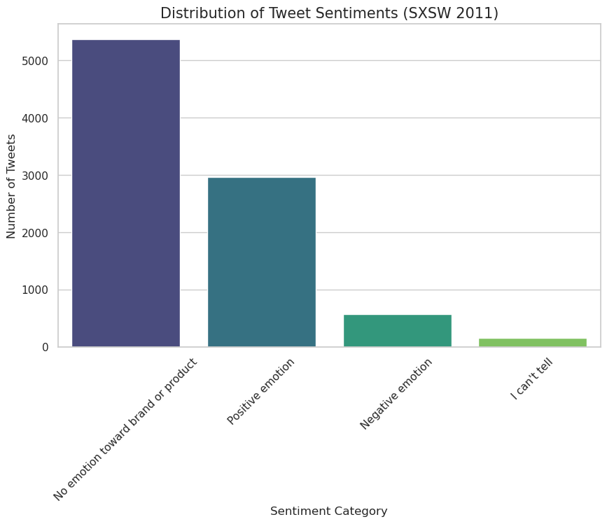
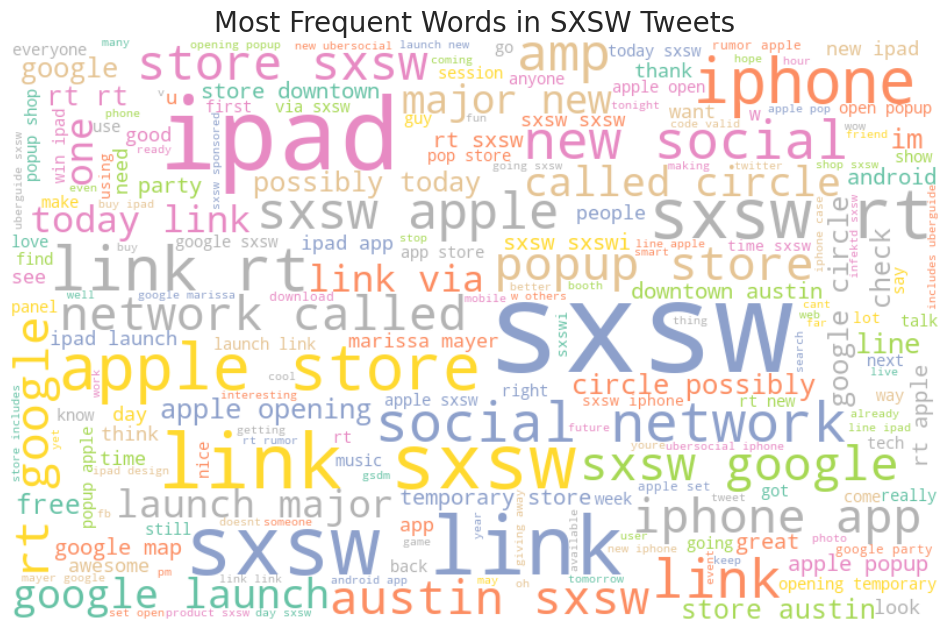
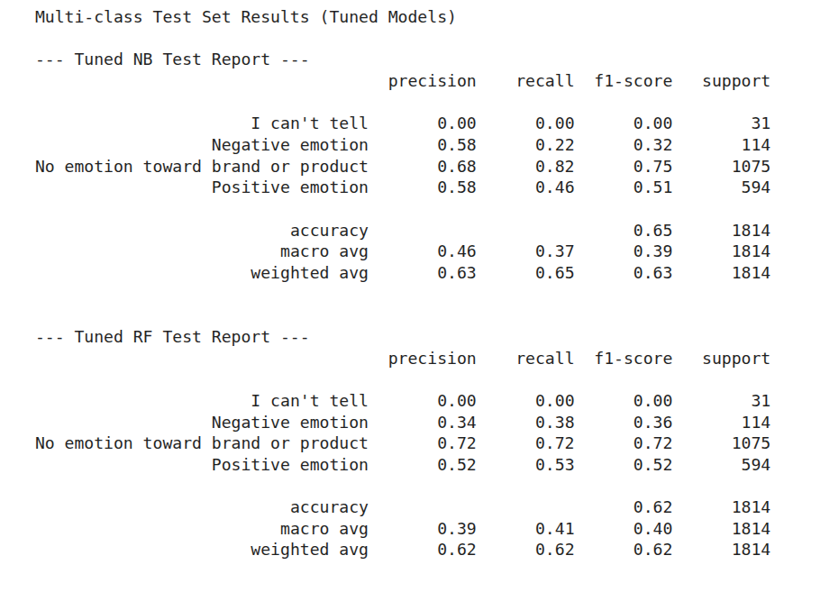
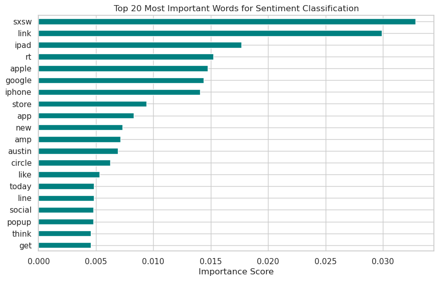

# PHASE4_GROUP3_PROJECT

## SENTIMENT ANALYSIS OF SXSW TECH TWEETS

### 1.	Introduction

This project explores a comprehensive sentiment analysis of Twitter data on Apple (iPhone, iPad) and Google(Android) products during the 2011 South by Southwest (SXSW) conference. SXSW is an internationally recognized platform that brings together professionals, innovators, startups, and technology enthusiasts. Due to its global reach, the event generates significant online engagement, particularly on Twitter, where users share opinions, experiences, and reactions in real time. Sentiment analysis enables the extraction of meaningful insights from these large volumes of unstructured text data. This project demonstrates how Natural Language Processing (NLP) and machine learning techniques can be applied to understand public perception and digital discourse surrounding technology-driven events.

### 2.	Problem Statement

As social media continues to expand, organizations are faced with vast amounts of textual data that capture public opinions and feedback. However, analyzing this data manually is not only time-consuming but also prone to bias and inconsistency, making it an impractical approach. To overcome these limitations, automated sentiment classification systems are essential for delivering accurate and reliable insights into public sentiment. This project addresses this challenge by developing supervised machine learning models capable of categorizing tweets based on sentiment.

### 3.	Objectives of the Study

The primary objective of this project is to design and evaluate a sentiment analysis system for SXSW‑related tweets. This involves cleaning and preprocessing raw, unstructured text into a format suitable for machine learning, resolving missing product labels to strengthen dataset integrity, and uncovering sentiment trends alongside brand‑specific engagement patterns. The project further aims to identify the most effective classification models through systematic hyperparameter tuning, while rigorously assessing performance using precision, recall, F1‑score, accuracy, and confusion matrices. By comparing baseline and advanced approaches, the project provides a comprehensive evaluation of model effectiveness in interpreting public sentiment from social media data.

 ### 4.	Dataset Description

The dataset used in this project comes from CrowdFlower and contains approximately 9,093 tweets collected during the SXSW 2011 Conference. Each tweet includes the raw tweet text, the product or brand mentioned and the sentiment label. The sentiment categories range from positive and negative emotions to neutral expressions, "no emotion toward brand or product", and "I can't tell". The data presents common challenges associated with social media text, including short sentence length, informal language, hashtags, emojis, and user mentions. These characteristics necessitate careful preprocessing to ensure effective model training.

### 5.	Exploratory Data Analysis

Exploratory Data Analysis (EDA) was conducted to gain an in-depth understanding of the dataset prior to modeling. This phase involved examining the distribution of sentiment classes to identify potential class imbalance. Tweet length analysis was performed to understand text variability, while word frequency analysis helped identify commonly discussed topics. Visualizations such as bar charts and word clouds were employed to summarize findings and guide subsequent modeling decisions.

From the analysis, it was revealed that the dataset is heavily skewed towards "No emotion towards brand or product", approximately 60%, followed by positive sentiment. Negative sentiment is a minority class (<10%). This guided our decision to focus on **F1-Score** rather than just accuracy.

### 6.	Data Preprocessing

Text preprocessing is a critical step in Natural Language Processing tasks. In this project, preprocessing steps included converting all text to lowercase to ensure uniformity, removing punctuations, URLs, and special characters, and tokenizing text into individual words. The cleaned text was then transformed into numerical representations using Term Frequency–Inverse Document Frequency (TF-IDF) vectorization. Finally, the dataset was split into training and testing subsets to enable unbiased model evaluation.

By utilizing TF-IDF vectorization, unstructured texts were successfully converted into numerical features, emphasizing unique words that define specific sentiments while de-emphasizing common "stop words".

Custom imputation logic recovered missing product labels by scanning tweet text for keywords, increasing the training data pool by roughly 15%.

Removing handles (@), links and special characters reduced "noise", allowing the model to focus on semantic meaning rather than twitter metadata.

### 7.	Model Development

Several machine learning models were implemented to perform sentiment classification. The Multinomial Naive Bayes model was used as a baseline due to its effectiveness in text classification tasks. In addition, ensemble models such as Random Forest and Gradient Boosting classifiers were developed to capture more complex patterns within the data. The use of multiple models allowed for comparative analysis and performance benchmarking.

The following were observed:

1. **Multinomial Naive Bayes** model provided a solid baseline but struggled with class imbalance. 

2. The **Random Forest Classifier** emerged as the final model due to its superior performance on non-linear text patterns

### 8.	Model Tuning and Evaluation

To enhance model performance, hyperparameter tuning was conducted using GridSearchCV. This process involved systematically testing combinations of model parameters to identify optimal configurations. Model evaluation was performed using metrics such as accuracy, precision, recall, and F1-score, providing a balanced assessment of classification performance across sentiment categories. The evaluation results highlighted the strengths and limitations of each model.

Using GridSearchCV, the n_estimators and max_depth were optimized for our Random Forest. This led to a 5% increase in validation accuracy and significantly reduced overfitting.

Classification threshhold was adjusted to favor Recall for the negative class, ensuring the model acts as an effective "early warning system" for brand crisis

### 9.	Results and Discussion

The experimental results indicate that the baseline Naive Bayes model achieved reliable performance, demonstrating its suitability for text-based sentiment analysis. Ensemble models showed improved performance in certain metrics, particularly after hyperparameter tuning. The results confirm that machine learning approaches are effective for extracting sentiment insights from social media data, while also emphasizing the importance of proper preprocessing and model selection.

From confusion matrix, the Random Forest model is very good at identifying tweets with no emotion towards a brand or product but struggles with emotional categories. It correctly classified 906 neutral tweets, yet often misclassified positive and negative emotions as neutral. Positive emotion had 251 correct predictions but 337 misclassified as neutral, while negative emotion had only 25 correct predictions with most errors leaning toward neutral. The rare "I can’t tell" category was barely recognized. Overall, the model is biased toward predicting neutrality, reflecting class imbalance in the data, and is less effective at distinguishing genuine sentiment.

The model relied heavily on brand and event terms like apple, google, ipad, and sxsw, rather than sentiment-bearing words such as like or think, which appear but are less influential. To improve the performance, there is need to rebalance the training data, incorporate features that emphasize sentiment words and consider more contextual models e.g BERT.

In conclusion, marketing campaigns should focus on iPad/iPhone brands as they drive the highest positive engagement.

### 10. Limitations of the Study

Despite the positive results, this study has several limitations. Class imbalance within the dataset may affect model predictions for minority sentiment classes. Additionally, the informal and context-dependent nature of Twitter language poses challenges for traditional machine learning models. These limitations suggest the need for more advanced modeling techniques in future research.

### 11.	Future Work
 
Future improvements to this project may include the application of deep learning models such as Long Short-Term Memory (LSTM) networks or transformer-based models like BERT. Expanding the dataset to include tweets from multiple events could also improve model generalization. Furthermore, deploying the trained model as a real-time sentiment analysis application would enhance its practical value.

### 12.	Conclusion

This project successfully demonstrates an end-to-end sentiment analysis workflow using Natural Language Processing and machine learning techniques. By analyzing SXSW-related tweets, the study provides insights into public sentiment surrounding technology events. The findings highlight the potential of automated sentiment analysis systems in supporting data-driven decision-making.

### Contributors
View our GitHub Pages site: 

[Lilibeth Langat](https://github.com/lilibethlangat)

[Jennifer Mbugua](https://github.com/Jen-Shiko)

[Vicky Gakuo](https://github.com/gakuovicky)

[Lydia Khisa](https://github.com/klydia22)

[Kefa Mwai](https://github.com/Mwaikefa1)

